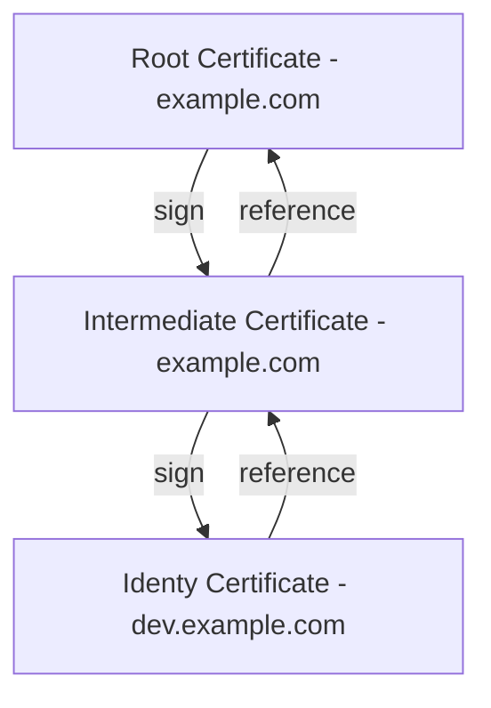

# PKI Secrets Engine

 * [Scenario](#scenario)
 * [Generate root CA](#root-ca)
 * [Generate intermediate CA](#intermediate-ca)
 * [Request certificates](#request-certificates)
 * [Revoke certificates](#revoke-certificates)
 * [Rotate Root CA](#rotate-root-ca)

<a name="scenario"/>

## Scenario

In this tutorial, you are going to first generate a self-signed root certificate.

Then you are going to generate an intermediate certificate that is signed by the root. You can then create a role and generate a certificate for the `dev.example.com` domain.



<a name="root-ca"/>

## Generate root CA

Enable the pki secrets engine at the pki path:

```
vault secrets enable pki
```

Tune the pki secrets engine to issue certificates with a maximum time-to-live (TTL) of 8760h hours (1 year).

```
vault secrets tune -max-lease-ttl=8760h pki
```

Generate the root CA, give it an issuer name, and save its certificate in the file `root-ca-2023.crt`:

```
vault write -field=certificate pki/root/generate/internal \
     common_name="Root CA" \
     issuer_name="root-ca-2023" \
     ttl=8760h > root-ca-2023.crt
```

Read the root CA certificate:

```
openssl x509 -in root-ca-2023.crt -noout -text
```

List the issuer information for the root CA:

```
vault list pki/issuers/
```

You can read the issuer with its ID to get the certificates and other metadata about the issuer:

```
vault read pki/issuer/<id>
```

A role is a logical name that maps to a policy used to generate those credentials:

```
vault write pki/roles/root-ca-2023 \
    allowed_domains=example.com \
    allow_subdomains=true
```

Configure the chain CA and CRL URLs:

```
vault write pki/config/urls \
     issuing_certificates="$VAULT_ADDR/v1/pki/ca" \
     crl_distribution_points="$VAULT_ADDR/v1/pki/crl"
```

Check insuing certificates url:

```
curl $VAULT_ADDR/v1/pki/ca --output ca.der
openssl x509 -inform DER -in ca.der -outform PEM -out ca.pem
openssl x509 -in ca.pem -noout -text
```

Check CRL distribution points:

```
curl $VAULT_ADDR/v1/pki/crl --output crl.der
openssl crl -inform DER -in crl.der -outform PEM -out crl.pem
openssl crl -in crl.pem -noout -text
```

<a name="intermediate-ca"/>

## Generate intermediate CA


Enable the pki secrets engine at the pki_int path:

```
vault secrets enable -path=pki_int pki
```

Tune the pki_int secrets engine to issue certificates with a maximum time-to-live (TTL) of 8760h hours (1 year).

```
vault secrets tune -max-lease-ttl=8760h pki_int
```

Execute the following command to generate an intermediate and save the CSR as `intermediate-ca.csr`:

```
vault write -format=json pki_int/intermediate/generate/internal \
     common_name="Intermediate CA" \
     issuer_name="intermediate-ca" \
     | jq -r '.data.csr' > intermediate-ca.csr
```

Read the intermediate CA certificate signing request:

```
openssl req -in intermediate-ca.csr -noout -text
```

Sign the intermediate certificate with the root CA private key, and save the generated certificate as `intermediate-ca.pem`.

```
vault write -format=json pki/root/sign-intermediate \
     issuer_ref="root-ca-2023" \
     csr=@intermediate-ca.csr \
     format=pem_bundle \
     ttl="8760h" \
     | jq -r '.data.certificate' > intermediate-ca.pem
```

Once the CSR is signed and the root CA returns a certificate, it can be imported back into Vault:

```
vault write pki_int/intermediate/set-signed certificate=@intermediate-ca.pem
```

Read the intermediate CA certificate:

```
openssl x509 -in intermediate-ca.pem -noout -text
```

Create a role for the intermediate CA:

```
vault write pki_int/roles/intermediate-ca \
     issuer_ref="$(vault read -field=default pki_int/config/issuers)" \
     allowed_domains="example.com" \
     allow_subdomains=true \
     max_ttl="72h"
```

Configure the chain CA and CRL URLs:

```
vault write pki_int/config/urls \
     issuing_certificates="$VAULT_ADDR/v1/pki_int/ca" \
     crl_distribution_points="$VAULT_ADDR/v1/pki_int/crl"
```

<a name="request-certificates"/>

## Request certificates

Execute the following command to request a new certificate for the `dev.example.com` domain:

```
vault write pki_int/issue/intermediate-ca common_name="dev.example.com" ttl="24h"
```

Execute the following command to request a new certificate for the `dev.wrong-example.com` domain (don't work):

```
vault write pki_int/issue/intermediate-ca common_name="dev.wrong-example.com" ttl="24h"
```

<a name="revoke-certificates"/>

## Revoke certificates

If a certificate must be revoked, you can easily perform the revocation action which will cause the CRL to be regenerated.

Get certificate serial number:

```
vault list pki_int/certs
```

To revoke a certificate, execute the following command:

```
vault write pki_int/revoke serial_number="<serial_number>"
```

Check CRL distribution points:

```
curl --header "X-Vault-Token: $VAULT_TOKEN" $VAULT_ADDR/v1/pki_int/crl --output crl-int.der
openssl crl -inform DER -in crl-int.der -outform PEM -out crl-int.pem
openssl crl -in crl-int.pem -noout -text
```

<a name="rotate-root-ca"/>

## Rotate Root CA

Enable another root CA in the existing PKI secrets engine mount:

```
vault write pki/root/rotate/internal \
    common_name="Root CA" \
    issuer_name="root-ca-2024"
```

Create a role for the new example.com root CA:

```
vault write pki/roles/root-ca-2024 \
    allowed_domains=example.com \
    allow_subdomains=true
```

The new root CA certificate can be deployed to all devices which require it as part of rotating out the old root CA.

After your defined cutoff point for the old root CA, and after you have distributed the new root CA to all devices, you'll want to switch the default issuer to the new root CA.

```
vault write pki/root/replace default=root-ca-2024
```

The last step is to sunset the old root CA.

You can effectively sunset the old root CA by removing its ability to issue certificates, while preserving the ability to sign CRLs and revoke certificates.

```
vault write pki/issuer/root-ca-2023 \
      issuer_name="root-ca-2023" \
      usage=read-only,crl-signing
```

You can confirm this by attempting to issue a certificate directly from the old root CA.

```
vault write pki/issuer/root-ca-2023/issue/root-ca-2023 \
    common_name="example.com"
```