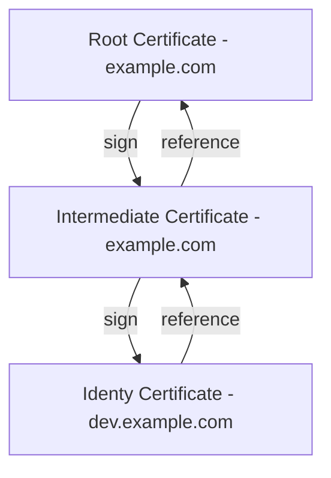

# PKI Secrets Engine

 * [Scenario](#scenario)
 * [Generate root CA](#root-ca)
 * [Generate intermediate CA](#intermediate-ca)
 * [Request certificates](#request-certificates)
 * [Revoke certificates](#revoke-certificates)
 * [Rotate Root CA](#rotate-root-ca)

<a name="scenario"/>

## Scenario

In this tutorial, you are going to first generate a self-signed root certificate.

Then you are going to generate an intermediate certificate that is signed by the root. You can then create a role and generate a certificate for the `dev.example.com` domain.

<a name="root-ca"/>

## Generate root CA

<a name="intermediate-ca"/>

## Generate intermediate CA

<a name="request-certificates"/>

## Request certificates

<a name="revoke-certificates"/>

## Revoke certificates

<a name="rotate-root-ca"/>

## Rotate Root CA
